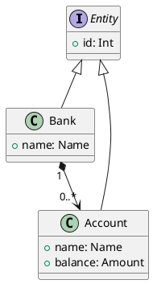

# Banking Domain

Let's illustrate our approach to domain modeling with a (substantially!)
simplified banking model:



Here, `Id`, `Name` and `Amount` are just convenient type aliases:

```kotlin
typealias Id = Int
typealias Name = String
typealias Amount = BigDecimal
```

## Vanilla Kotlin Properties

Let's assume our `Bank` entity requires its `name` not to be empty. However,
we also want to be forgiving and allow client code to pass names with unruly
whitespace in the expectation we'll normalize it prior to storing it.

With these specs, our first-cut `Bank` entity class would look like:

```kotlin
class Bank(initialName: String) : Entity<Bank> by Entity() {
    var name: Name // Look ma: semantic type alias
        set(value) {
            value
                .trim() // Remove heading/trailing whitespace
                .split("\\s+".toRegex()) // Separate non-blank substrings
                .joinToString(" ") // Join'em back with single spaces
                .also {
                    // Validate result
                    require(it.isNotEmpty()) { "Invalid blank bank name" }
                    // Store it
                    field = it
                }
        }
}
```

Given this definition, we can test our `name` property as follows:

```kotlin
// Sets name properly, check
val bank = Bank("Monopoly Bank")
assertEquals("Monopoly Bank", bank.name)

// Normalizes whitespace in name, check
bank.name = "\tACME\t \tBank "
assertEquals("ACME Bank", bank.name)

// But: name cannot be completely blank or empty
assertFailsWith(IllegalArgumentException::class) {
    Bank("\t \t")
}
```

Fair enough!

## Name Normalization

Anticipating name normalization reuse in our domain, we may want to capture
name normalization as:

```kotlin
fun String.normalizeSpace() =
    trim().split("\\s+".toRegex()).joinToString()
```

This would allow for other names in our banking domain (such as account
aliases, for instance) to benefit from our leniency with name whitespace.

Our revised class would now look like:

```kotlin
class Bank(initialName: Name) : Entity<Bank> by Entity() {
    var name: Name // Look ma: semantic type alias
        set(value) {
            value
                // Added bonus: we now emphasize what, not how
                .let(String::normalizeSpace)
                .also {
                    require(it.isNotEmpty()) { "Invalid blank bank name" }
                    field = it
                }
        }
}
```

## More Name Validation: Length

We may also want to restrict bank name length to be between 4 and 32
characters long:

```kotlin
class Bank(initialName: Name) : Entity<Bank> by Entity() {
    var name: Name // Look ma: semantic type alias
        set(value) {
            value
                // Added bonus: we now emphasize what, not how
                .let(String::normalizeSpace)
                .also {
                    require(it.isNotEmpty()) { "Invalid blank bank name" }
                    require(it.length in 4..32) {
                        """
                            Invalid bank name length (${it.length}),
                            must be between 4 and 32
                        """.normalizeSpace()
                    }
                    field = it
                }
        }
}
```

Our validation tests would now look like:

```kotlin
// Name cannot be completely blank or empty
assertFailsWith(IllegalArgumentException::class) { Bank("\t \t") }
assertFailsWith(IllegalArgumentException::class) { Bank("bit") }
assertFailsWith(IllegalArgumentException::class) { Bank("a".repeat(33)) }
```

# DSL for Scalar Property Declaration

Given our example `name` property, let's see how we can make its definition
simpler and more declarative.

For this we'll use a DSL exposing per-type functions for returning Kotlin
[_property delegates_](https://kotlinlang.org/docs/delegated-properties.html)
properly configured for value normalization and validation:

```kotlin
class Bank(initialName: Name) : Entity<Bank> by Entity() {
    // `string` is a delegate provider, not a type
    var name by string(initialName) {
        normalizeWith(String::normalizeSpace)
        rule(1000, nonEmpty) { "Bank name cannot be blank" }
        val minLength = 4
        val maxLength = 32
        rule(1001, lengthRange(minLength, maxLength)) {
            """
                Invalid bank name length (${it.length}),
                must be between $minLength and $maxLength
            """
        }
    }
}
```

Given the above definition, we can test `Bank` instances like so:

```kotlin
val bank = Bank("Monopoly Bank")
assertEquals("Monopoly Bank", bank.name)
bank.name = "\tACME\t \tBank "
assertEquals("ACME Bank", bank.name)
val exception1 = assertFailsWith(DomainException::class) { Bank("\t \t") }
assertEquals(1000, exception1.code) // Empty
val exception2 = assertFailsWith(DomainException::class) { Bank("bit") }
assertEquals(1001, exception2.code) // Too short
val exception3 = assertFailsWith(DomainException::class) {
    Bank("a".repeat(33))
}
assertEquals(1001, exception3.code) // Too long
```

Beyond mere reduction in code line count (which, of course, is cool in
and of itself), this DSL also makes intention explicit by allowing the
developer to declaratively _state_ what he/she wants to achieve rather than
just implementing it by hand. We favor expressing _what_ we want over _how_
to do it.

> 👉 So far, using the `string` delegate may not look like such a _big_ boon,
> but things get better (and simpler!) the more we leverage the data
> definition DSL.

## Associating Codes with Messages

Another advantage provided by our data definition DSL is that rules allow for
unique integer identifiers to be associated with error conditions (and,
indeed, with any type of message.)

This supports defining (spoken) language-specific rendition of application
messages, which is extremely useful for GUI's:

```kotlin
object BankMessages : Messages<Bank>({
    // Internationalization
    English {
        rule(1000, "Non-empty name") {
            prompt("Bank Name")
            fyi("Enter a name between 4 and 32 characters long")
            error { "Invalid length (${it.length}. Must be between 4 and 32" }
        }
    }
    // Internationalization
    Spanish {
        rule(1000, "Nombre no vacío") {
            prompt("Nombre de banco")
            fyi("Provee un nombre de entre 4 y 32 caracteres")
            error { "Longitud (${it.length} inválida. Debe estar entre 4 y 32" }
            // Localization
            Ecuador {
                fyi("Digita un nombre de entre 4 y 32 caracteres")
            }
            Colombia {
                fyi("Teclea un nombre de entre 4 y 32 caracteres")
            }
        }
    }
})
```

## Explicitly Defining Metadata

In our example above, we can gain clarity and maintainability by moving the
minimum and maximum lengths out of their usage context and onto the entity's
companion object:

```kotlin
class Bank(initialName: Name) : Entity<Bank> by Entity() {
    var name by string(initialName) {
        normalizeWith(String::normalizeSpace)
        rule(1000, nonEmpty) { "Bank name cannot be blank" }
        rule(1001, lengthRange(MIN_NAME_LENGTH, MAX_NAME_LENGTH)) {
            """
                Invalid bank name length (${it.length}),
                must be between $MIN_NAME_LENGTH and $MAX_NAME_LENGTH
            """
        }
    }

    companion object {
        // Look ma: type-safe, editable constraint metadata
        const val MIN_NAME_LENGTH = 4
        const val MAX_NAME_LENGTH = 32
    }
}
```

By doing this, we may revise minimum and maximum name length in the future
and apply the change only on the companion object from where it will 
propagate everywhere!

This is advantageous, too, for message i18n and l11n:

```kotlin
object BankMessages : Messages<Bank>({
    English {
        rule(1000, "Non-empty name") {
            prompt("Bank Name")
            fyi(
                """
                Enter a name between ${Bank.MIN_NAME_LENGTH} and
                ${Bank.MAX_NAME_LENGTH} characters long
            """
            )
            error {
                """
                Invalid length (${it.length}.
                Must be between  ${Bank.MIN_NAME_LENGTH} and
                ${Bank.MAX_NAME_LENGTH}
            """
            }
        }
    }
})
```

The general mantra here is making metadata explicit and editable by extracting
it from incidental code usages and promoting it to first-class citizenship.

## Ensuring Property and Entity Integrity

As a design rule, we don't want our domain entity classes to wildly expose
their internals so client code can mess with them at their will (and at our
peril).

It's good practice to protect writable properties (such as the bank's `name`
above) from unrestricted mutation. Thus, we revise our above property
definition to make `name` un-writable by client code but, in exchange, gain
semantic clarity by giving the rename operation a meaningful name:

```kotlin
var name by string(initialName) {
    normalizeWith(String::normalizeSpace)
    rule(1000, nonEmpty) { "Bank name cannot be blank" }
    rule(1001, lengthRange(MIN_NAME_LENGTH, MAX_NAME_LENGTH)) {
        """
            Invalid bank name length (${it.length}),
            must be between $MIN_NAME_LENGTH and $MAX_NAME_LENGTH
        """
    }
}
    private set // Look ma: clients can't mutate name directly!

// Renames bank and returns old name
fun renameTo(newName: Name): Name =
    name.also {
        // ... any associated side-effect would take place here...
        name = newName
    }
```

Here, we mark the `name` property as `private set` so it cannot be freely
mutated by client code.

We also add a meaningful `renameTo` method that sets the new name and
courteously returns the old one.

Given these changes, we can test our `Bank` class like so:

```kotlin
val bank = Bank("Monopoly Bank")
assertEquals("Monopoly Bank", bank.name)
bank.renameTo("\tACME \t Bank ")
assertEquals("ACME Bank", bank.name)
val exception = assertFailsWith(DomainException::class) { Bank("bit") }
assertEquals(1001, exception.code)
```

Adding a mutation `renameTo` method may not seen palatable to some who
might argue we've increased complexity without major gains in preserving
integrity (in the end, we can trust ourselves to carefully craft
integrity-preserving client code, right? 😉).

However, as we'll see later on, when the `name` participates of some other
structure (such as a `Map<Name, Bank>` used to guarantee bank name
uniqueness, for instance), the `renameTo` operation will need to take care
of verifying the new name is not a duplicate _and_ replacing the old name
with the new one in the map.

We wouldn't want our clients to be responsible for keeping things in sync or
(worse yet!) to subvert our cherished uniqueness-ensuring mechanism.

[Previous: The `Entity` Interface](01-entity-interface.md)
